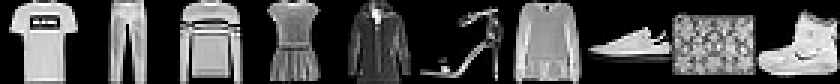

# EDA — Fashion-MNIST

Dataset retenu le 2026-08-13 (voir `HISTORY.md`). Analyse exploratoire complète (checklist `TASKS.md` > Data / Experiment Engineer > EDA).

## Volumétrie et format

- Train : 60000 images, shape `(28, 28)`, dtype `uint8`
- Test : 10000 images, shape `(28, 28)`, dtype `uint8`

## Valeurs manquantes / fichiers corrompus

- Intégrité du fichier déjà vérifiée en amont par le checksum MD5 de torchvision au chargement (le chargement aurait échoué sinon) — voir aussi `scripts/resumable_download.py`, qui revérifie le même MD5 après téléchargement.
- Labels hors [0, 9] train : 0, test : 0

## Valeurs aberrantes

- Plage de pixels train : [0, 255] (attendu [0, 255], garanti par le dtype `uint8` — indicatif, pas un test de corruption)
- Images dégénérées (entièrement uniformes, ex. tout à 0) train : 0, test : 0
- Toutes les images ont la même résolution 28×28 (garanti par le format IDX du dataset)

## Doublons exacts (hash MD5 par image)

- Doublons dans train : 0
- Doublons dans test : 0

## Équilibre des classes

|Classe|Nom|Train|Test|
|---|---|---|---|
|0|T-shirt/top|6000|1000|
|1|Trouser|6000|1000|
|2|Pullover|6000|1000|
|3|Dress|6000|1000|
|4|Coat|6000|1000|
|5|Sandal|6000|1000|
|6|Shirt|6000|1000|
|7|Sneaker|6000|1000|
|8|Bag|6000|1000|
|9|Ankle boot|6000|1000|

Classes parfaitement équilibrées (6000 train / 1000 test par classe) — pas de rééquilibrage nécessaire.

## Statistiques de pixels (base de la normalisation)

- Moyenne (train) : 72.940
- Écart-type (train) : 90.021
- Pour la diffusion, normalisation prévue dans [-1, 1] : `x_norm = x / 127.5 - 1` (cf. `TASKS.md` > pipeline de chargement).

## Échantillon visuel (une image par classe)

## Observations

- Dataset propre : pas de valeurs manquantes, pas de doublons exacts, pixels dans la plage attendue [0, 255], classes strictement équilibrées.
- Faible variance de moyenne/écart-type entre classes attendue (niveaux de gris, fond uniforme) : bon candidat pour un DDPM/GAN from scratch avec budget de calcul limité.
- Aucun biais de classe détecté à ce stade ; à surveiller en cas de mode collapse du GAN sur des classes visuellement proches (ex. Shirt/Pullover/Coat).